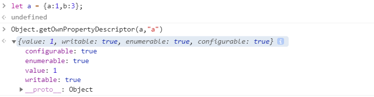
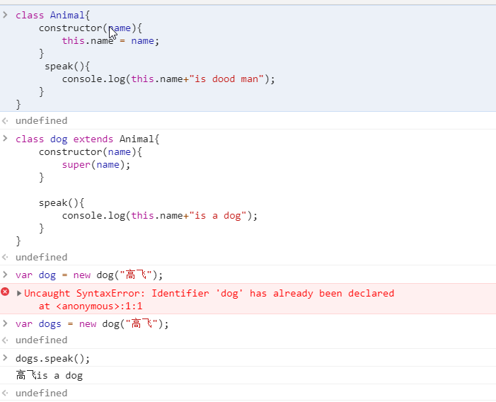
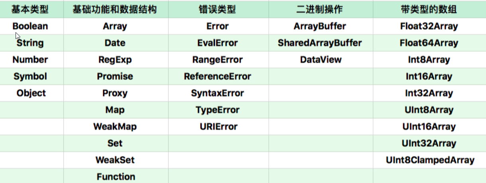

# JavaScript 对象

## 一.两类属性

1. 属性并非知识简单的名称和值,JavaScript用一组特征来描述属性;

   1. 第一类属性,数据属性

      - value: 属性的值
      - writable: 决定属性是否能被赋值
      - enumerable: 决定for in能否枚举该属性
      - configurable: 决定该属性能否被删除或者`改变特征值`

   2. 第二类属性是 访问器(getter/setter)

      - getter: 函数或者undefined,在取属性值时被调用
      - setter: 函数或者undefined,在设置属性值时被调用
      - enumerable: 决定for in 能否枚举该属性
      - configurable: 决定该属西能否被删除或者`改变特征值`

   3. 我们通常定义属性的代码会产生数据属性,其中的writable,enumerable,configurable都某人为true,即为: 可写,可枚举,可删除,可修改; 使用`Object.getOwnPropertyDescripter` 来查看这些属性值;

      


## 二. JavaScript核心---原型

### 2.1  编辑式创建对象

```javascript
//cat 是一个对象,这里当作一个原型
var cat = {
    say(){
        console.log("meow~");
    },
    jump(){
        console.log("jump");
    }
}
// tiger是一个对象,它拥有原型的大部分功能,具体的属性信有自定义的修改
var tiger = Object.create(cat,  {
    say:{
        writable:true,
        configurable:true,
        enumerable:true,
        value:function(){
            console.log("roar!");
        }
    }
})

// 又是一个以cat为原型的对象
var anotherCat = Object.create(cat);

anotherCat.say(); //meow~

var anotherTiger = Object.create(tiger);

anotherTiger.say(); //roar! 

Object.setPrototypeOf(anotherTiger,cat);

anotherTiger.say //meow~

// 他们又分别为其他对象过的原型,可以通过控制他们(如修改他们的代码)来控制其他对象

```


### 2.2 构造式创建对象

```javascript
function c1(){
    this.p1 = 1;
    this.p2 = function(){
        console.log(this.p1);
    }
} 
var o1 = new c1;
o1.p2();


function c2(){
}
c2.prototype.p1 = 1;
c2.prototype.p2 = function(){
    console.log(this.p1);
}

var o2 = new c2;
o2.p2();
```


### 2.3 Js中的类对象



- 在 JS中定义一个类,直接用this.`成员变量`,就不用手动生成了;

- 在JS文件中调用对象的方法,瞬间牛逼起来了


## 三. JavaScript中的对象类型

- 宿主对象(host objects): 由JavaScript宿主环境提供的对象,它们的行为完全由宿主决定;
- 内置对象(Buit-in objects): 由 JavaScript语言提供的对象
  - **固有对象**:由标准规定,随着JavaScript运行时创建而自动创建的对象实例
  - **原生对象**:可以由用户通过Array、RegExp等内置构造器或者特殊语法创建的对象。
  - **普通对象**（Ordinary Objects）：由{}语法、Object构造器或者class关键字定义类创建的对象，它能够被原型继承。


### 3.1 宿主对象

Javascript的宿主,一般来说就是浏览器本身了,比如window, window上又有很多属性,如document,这个全局的window对象一部分来自浏览器,一部分来自JavaScript本身;


### 3.2 内置对象:固有对象

固有对象是由JS所符合的标准和规范制定的,随着JS的运行而自动创建的对象实例;


固有对象在js代码执行之前就已经创建好了,通常扮演类似基础库的角色;


ECMA标准提供了一份固有对象表,包含150+个对象.


### 3.3 内置对象:原生对象

JavaScript中能够通过语言本身创建的对象叫做原生对象,JavaScript提供了30多个构造器;




- **可以通过new构造这些对象**

这些字段使得原型继承方法无法正常工作，所以，我们可以认为，所有这些原生对象都是为了特定能力或者性能，而设计出来的“特权对象”。